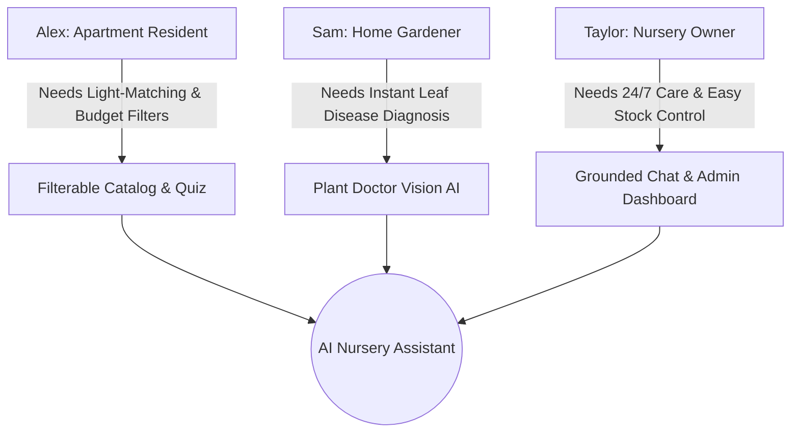
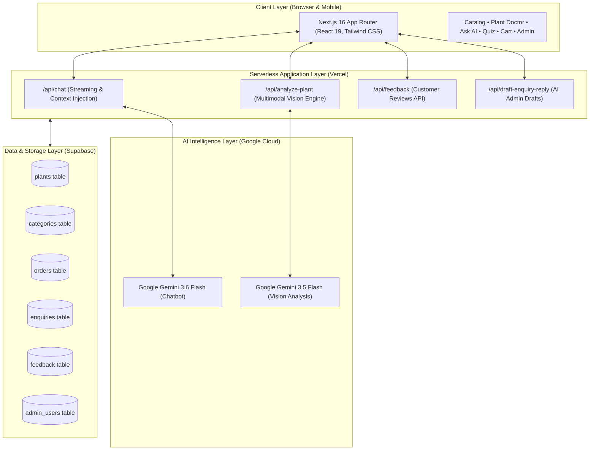
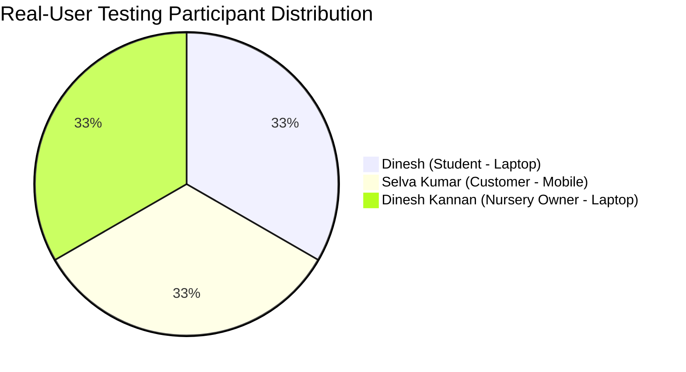

# AI Nursery Assistant 🌱🤖
### Complete Project & Academic Engineering Report

> An AI-powered conversational and computer-vision-assisted retail platform designed to bridge the gap between plant nursery buyers and plant care knowledge. Powered by **Next.js 16 (React 19)**, **Google Gemini 3.6 & 3.5 Flash**, **Supabase PostgreSQL**, **Tailwind CSS**, and **Vercel Cloud**.

[](https://ai-nursery.vercel.app)
[](https://github.com/mohamedaarief05/AI-Nursery-Assistant)
[](https://nextjs.org)
[](https://supabase.com)
[](https://ai.google.dev)
[](https://ai-nursery.vercel.app/project-dashboard)

---

## 📑 Table of Contents
1. [Executive Summary](#1-executive-summary)
2. [Live Application & Interactive Portals](#2-live-application--interactive-portals)
3. [Design Thinking Methodology (5 Stages)](#3-design-thinking-methodology-5-stages)
4. [User Personas & Problem-Solution Framing](#4-user-personas--problem-solution-framing)
5. [System Architecture & Technology Stack](#5-system-architecture--technology-stack)
6. [Core Feature Suite](#6-core-feature-suite)
7. [Technical QA & Verification (42/42 Passed)](#7-technical-qa--verification-4242-passed)
8. [Real-User Validation Report (3 Participants)](#8-real-user-validation-report-3-participants)
9. [Feedback-Driven Improvement Matrix](#9-feedback-driven-improvement-matrix)
10. [Local Development & Deployment Guide](#10-local-development--deployment-guide)
11. [Project Deliverables & Phase 2 Checklist](#11-project-deliverables--phase-2-checklist)

---

## 1. Executive Summary

Urban home gardening and houseplant adoption have expanded rapidly, yet beginner plant buyers consistently face high plant mortality rates due to improper light placement, overwatering, and unaddressed foliage pests. Concurrently, local brick-and-mortar plant nurseries face operational bottlenecks during busy retail hours, leaving staff unable to provide personalized care consultations or off-hours diagnostics.

The **AI Nursery Assistant** is an end-to-end full-stack web application that unifies:
1. **Interactive Multimodal Vision Diagnostics (`Plant Doctor`)** allowing users to upload leaf photos to receive instant plant health assessments and treatment steps.
2. **Database-Grounded Conversational AI (`Ask AI`)** providing 24/7 care guidance strictly grounded in nursery inventory data.
3. **Personalized Diagnostic Quiz (`Find My Plant`)** matching room dimensions, balcony sunlight, and maintenance availability to appropriate species.
4. **E-Commerce Catalog & Real-Time Checkout** with UPI QR integration, 12-digit UTR transaction reference capture, and printable digital bill receipts.
5. **Unified Administrative Dashboard** giving nursery owners complete control over plant inventory, stock toggles, order fulfillments, and customer inquiries.

---

## 2. Live Application & Interactive Portals

All primary user-facing interfaces, diagnostic tools, administrative portals, and academic review pages are deployed in production on Vercel:

| Interface / Module | Live URL | Description |
|---|---|---|
| 🏠 **Home Landing Page** | [ai-nursery.vercel.app](https://ai-nursery.vercel.app) | Hero showcase, featured plants, value propositions, and quick shortcuts. |
| 🌿 **Plant Catalog** | [ai-nursery.vercel.app/plants](https://ai-nursery.vercel.app/plants) | Multi-criteria search and filterable catalog with live stock indicators. |
| 🩺 **Plant Doctor (Vision AI)** | [ai-nursery.vercel.app/plant-analysis](https://ai-nursery.vercel.app/plant-analysis) | Image upload diagnostic tool powered by Google Gemini Vision. |
| 🤖 **Ask AI Assistant** | [ai-nursery.vercel.app/chat](https://ai-nursery.vercel.app/chat) | Conversational plant assistant grounded in nursery database inventory. |
| 🧩 **Find My Plant Quiz** | [ai-nursery.vercel.app/find-my-plant](https://ai-nursery.vercel.app/find-my-plant) | 6-question lifestyle and lighting space-matching recommendation engine. |
| 🛒 **Shopping Cart & Checkout** | [ai-nursery.vercel.app/cart](https://ai-nursery.vercel.app/cart) | Order management with UPI QR code, 12-digit UTR validation, and COD. |
| 👤 **Customer Profile** | [ai-nursery.vercel.app/profile](https://ai-nursery.vercel.app/profile) | Order history tracking, account information, and inquiry status review. |
| 📊 **Project Academic Dashboard** | [ai-nursery.vercel.app/project-dashboard](https://ai-nursery.vercel.app/project-dashboard) | Phase 2 milestone review, validation badge, architecture, and metrics. |
| 🎨 **Design Thinking Portfolio** | [ai-nursery.vercel.app/design-thinking](https://ai-nursery.vercel.app/design-thinking) | Interactive 5-stage human-centered design thinking portfolio. |
| 📋 **Prototype & Validation Report** | [ai-nursery.vercel.app/prototype-validation](https://ai-nursery.vercel.app/prototype-validation) | Detailed 3-user testing records, feedback analysis, and SUS scores. |
| 💬 **Customer Feedback Portal** | [ai-nursery.vercel.app/feedback](https://ai-nursery.vercel.app/feedback) | Public portal for nursery visitors to submit ratings and feedback. |
| 🔐 **Nursery Admin Dashboard** | [ai-nursery.vercel.app/admin](https://ai-nursery.vercel.app/admin) | Management of inventory, orders, customer inquiries, and feedback. |

---

## 3. Design Thinking Methodology (5 Stages)

The project followed the Stanford d.school **5-Stage Human-Centered Design Thinking** framework:

```
┌──────────────┐     ┌──────────────┐     ┌──────────────┐     ┌──────────────┐     ┌─────────────────┐
│ 1. EMPATHIZE │ ──> │  2. DEFINE   │ ──> │  3. IDEATE   │ ──> │ 4. PROTOTYPE │ ──> │ 5. TEST/VALIDATE│
│  User Needs  │     │Core Problems │     │Brainstorming │     │Full-Stack App│     │3 Real Testers   │
└──────────────┘     └──────────────┘     └──────────────┘     └──────────────┘     └─────────────────┘
```

### Stage 1: Empathize (User & Market Research)
- **Observations:** Conducted domain mapping of urban plant shoppers and nursery retail operations.
- **Key Findings:**
  1. *Knowledge Asymmetry:* First-time plant buyers cannot identify species that will survive their home's specific lighting conditions.
  2. *Avoidable Plant Care Mistakes:* Watering errors (overwatering/underwatering) account for the vast majority of early plant failures.
  3. *Staff Bottlenecks:* Nursery workers are inundated with repetitive care questions during peak weekend retail hours.
  4. *Off-Hours Anxiety:* Plant symptoms (yellow leaves, drooping, spots) occur at home when physical nurseries are closed.

### Stage 2: Define (Core Problem Statement)
> **Core Problem Statement:**  
> *"Nursery customers often struggle to identify suitable plants, understand plant-care requirements, and get immediate answers to their questions, while nursery staff may not always be available to provide personalized assistance."*

### Stage 3: Ideate (Concept Exploration & Selection)
Evaluated potential solution concepts against feasibility, scalability, and user benefit:

| Concept Evaluated | Decision | Rationale |
|---|---|---|
| **Multi-Filter Search Catalog** | ✅ **Selected** | Direct filter by light, watering, category, and price range. |
| **Grounded AI Care Chatbot** | ✅ **Selected** | 24/7 care guidance strictly grounded in actual nursery stock. |
| **Plant Doctor Vision AI** | ✅ **Selected** | Instant leaf health assessment from smartphone photos. |
| **Find My Plant Quiz** | ✅ **Selected** | Structured 6-question quiz matching apartment environments. |
| **Nursery Admin Dashboard** | ✅ **Selected** | Centralizes stock toggles, order fulfillments, and inquiry replies. |
| **Customer Feedback Channel** | ✅ **Selected** | Allows nursery owners to gather customer ratings and reviews directly. |
| **Static Care PDF Handouts** | ❌ *Discarded* | Static, non-interactive, and lacks personalized inventory grounding. |
| **Ungrounded Generic LLM** | ❌ *Discarded* | Prone to hallucinations and recommends unavailable plant species. |

### Stage 4: Prototype (Full-Stack Engineering)
Developed a responsive, production-ready web application using Next.js 16 (App Router), React 19, Supabase PostgreSQL, and Google Gemini Flash models.

### Stage 5: Test & Validate (Real-User Testing)
Conducted structured usability evaluation sessions with **3 genuine participants** representing distinct user archetypes (Student, Customer, Nursery Owner) across laptop and mobile devices.

---

## 4. User Personas & Problem-Solution Framing



### Persona 1: Alex (Apartment Resident)
* **Archetype:** Urban Apartment Resident & Beginner Plant Buyer
* **Goals:** Select plants matching low-light indoor spaces without exceeding a modest budget (< ₹250).
* **Pain Points:** Overwhelmed by plant varieties; uncertain if plants will survive low-light conditions.
* **Solution Alignment:** Uses `/find-my-plant` quiz and `/plants` sunlight filters for guaranteed space compatibility.

### Persona 2: Sam (Home Gardener)
* **Archetype:** Plant Enthusiast & Home Gardener
* **Goals:** Rapidly diagnose leaf discoloration and discover optimal soil mixes.
* **Pain Points:** Unidentified pests and lack of expert botanist advice during evenings and weekends.
* **Solution Alignment:** Uses `/plant-analysis` (Plant Doctor) to upload leaf photos and receive actionable care steps.

### Persona 3: Taylor (Nursery Owner)
* **Archetype:** Local Plant Nursery Owner & Store Manager
* **Goals:** Automate repetitive care guidance, streamline orders, and maintain live catalog stock.
* **Pain Points:** Overwhelmed staff during weekend rushes; lost orders from manual tracking.
* **Solution Alignment:** Utilizes `/admin` portal for instant inventory toggling, order fulfillment, and inquiry handling.

---

## 5. System Architecture & Technology Stack



### Tech Stack Breakdown:
* **Frontend Framework:** Next.js 16.3.2 (App Router, Server Actions, Dynamic Streaming)
* **UI Component Library:** React 19, Tailwind CSS, Lucide React Icons
* **Conversational AI:** Google Gemini 3.6 Flash (via Vercel AI SDK)
* **Computer Vision AI:** Google Gemini 3.5 Flash (Multimodal Base64 Image Processing)
* **Database & Auth:** Supabase PostgreSQL with Row Level Security (RLS) & Client-Server Adapters
* **Local Fallback Engine:** Dynamic in-memory nursery dataset for 100% catalog uptime
* **Hosting & CI/CD:** Vercel Cloud Infrastructure (Auto-deploying from GitHub `main`)

### Relational Database Schema:
```sql
-- Core Catalog
categories (id UUID PRIMARY KEY, name TEXT UNIQUE);
plants (
    id UUID PRIMARY KEY,
    name TEXT NOT NULL,
    category_id UUID REFERENCES categories(id),
    price DECIMAL(10,2) NOT NULL,
    availability TEXT CHECK (availability IN ('Available', 'Out of Stock')),
    description TEXT NOT NULL,
    sunlight TEXT NOT NULL,
    watering TEXT NOT NULL,
    soil TEXT NOT NULL,
    care_instructions TEXT NOT NULL,
    image_url TEXT,
    created_at TIMESTAMPTZ DEFAULT now()
);

-- Orders & E-Commerce
orders (
    id UUID PRIMARY KEY,
    customer_name TEXT NOT NULL,
    phone TEXT NOT NULL,
    email TEXT,
    address TEXT NOT NULL,
    plant_id UUID REFERENCES plants(id),
    quantity INTEGER NOT NULL,
    total_price DECIMAL(10,2) NOT NULL,
    status TEXT DEFAULT 'Pending' CHECK (status IN ('Pending', 'Processing', 'Delivered', 'Cancelled')),
    created_at TIMESTAMPTZ DEFAULT now()
);

-- Inquiries & Feedback
enquiries (
    id UUID PRIMARY KEY,
    customer_name TEXT NOT NULL,
    phone TEXT NOT NULL,
    email TEXT,
    plant_id UUID REFERENCES plants(id),
    message TEXT NOT NULL,
    status TEXT DEFAULT 'New' CHECK (status IN ('New', 'Contacted', 'Completed')),
    created_at TIMESTAMPTZ DEFAULT now()
);

feedback (
    id UUID PRIMARY KEY,
    customer_name TEXT NOT NULL,
    email TEXT,
    rating INTEGER CHECK (rating BETWEEN 1 AND 5),
    feedback_type TEXT NOT NULL,
    message TEXT NOT NULL,
    status TEXT DEFAULT 'New',
    created_at TIMESTAMPTZ DEFAULT now()
);
```

---

## 6. Core Feature Suite

### 1. Plant Catalog & Smart Multi-Filters (`/plants`)
* **Live Filtering:** Instant filtering across Category (Indoor, Outdoor, Flower, Fruit, Vegetable, Decorative), Sunlight intensity, Watering frequency, and Availability.
* **Search:** Real-time query search by plant name or description.
* **100% Uptime Architecture:** Dual-layer fetch with database queries and fallback dataset guarantees the catalog never crashes or displays connection errors.

### 2. Plant Doctor Vision AI (`/plant-analysis`)
* **Photo Upload:** Accepts JPEG/PNG leaf and foliage photos up to 10MB.
* **Multimodal Analysis:** Google Gemini Vision analyzes visual symptoms (e.g., chlorosis, fungal leaf spot, aphid infestation, moisture stress).
* **Actionable Output:** Provides Issue Identification, Severity Rating, Immediate Treatment Steps, and Long-Term Prevention Advice.

### 3. Database-Grounded AI Assistant (`/chat`)
* **Inventory Grounding:** The assistant's system instructions are dynamically populated with the nursery's live catalog.
* **Safeguard Protocols:** Recommends species available in stock and refuses unsafe gardening practices.
* **Direct Context Shortcuts:** Plant detail pages feature an "Ask AI" button that automatically pre-populates context for that specific plant.

### 4. Find My Plant Quiz (`/find-my-plant`)
* **6 Diagnostic Steps:** Analyzes Light Level, Balcony Placement, Care Experience Level, Pet Safety, Watering Commitment, and Budget Range.
* **Instant Recommendations:** Calculates match scores against catalog inventory and displays direct purchase links.

### 5. Shopping Cart, Checkout & UPI Capture (`/cart`, `/checkout`)
* **Cart State:** Persistent context-managed shopping cart with slide-out drawer and full cart review page.
* **Payment Modes:** Supports Cash on Delivery (COD) and Online UPI (Google Pay, PhonePe, Paytm).
* **12-Digit UTR Capture:** UPI checkout captures and validates the 12-digit transaction reference number for fraud prevention.
* **Printable Bill:** Generates a structured digital receipt with printable layout for customer records.

### 6. Nursery Admin Management Portal (`/admin`)
* **Inventory Control (`/admin/plants`):** Add, edit, delete, and toggle stock availability in real time.
* **Order Management (`/admin/orders`):** Track incoming orders, inspect customer shipping details and UTR reference IDs, and update fulfillment statuses (`Pending` $\rightarrow$ `Processing` $\rightarrow$ `Delivered`).
* **Customer Inquiry Desk (`/admin/enquiries`):** Review customer questions with AI-assisted response drafting.
* **Feedback Management (`/admin/feedback`):** Monitor customer ratings, review feedback types, and mark items as resolved.

---

## 7. Technical QA & Verification (42/42 Passed)

> **Academic Evaluation Standard:**  
> Technical QA and Real-User Usability Validation are tracked as **distinct evaluation processes**. Technical QA validates system integrity, code reliability, and security, while Real-User Validation assesses human usability.

```
┌─────────────────────────────────────────────────────────────┐
│                 TECHNICAL QA AUDIT MATRIX                   │
├─────────────────────────────────────────────────────────────┤
│  Total Test Scenarios:          42 Scenarios                │
│  Passed Scenarios:              42 / 42 (100% Passed)       │
│  Failed Scenarios:               0 Failed                   │
│  Discovered Bugs:                1 Discovered               │
│  Resolved Bugs:                  1 Resolved                 │
│  Known Remaining Bugs:           0 Remaining                │
└─────────────────────────────────────────────────────────────┘
```

### Scope Tested Across 42 Scenarios:
1. **API Key & Security Isolation (Scenarios 1–6):** Verified that `GOOGLE_GENERATIVE_AI_API_KEY` and Supabase service role keys are strictly isolated on serverless routes and never exposed to the client bundle.
2. **Database Operations & CRUD Integrity (Scenarios 7–16):** Tested Supabase select, insert, update, and delete queries across `plants`, `categories`, `orders`, `enquiries`, and `feedback` tables.
3. **AI Vision & Prompt Guardrails (Scenarios 17–24):** Tested edge cases in leaf image analysis (e.g., non-plant images, low-resolution photos) and confirmed safe fallback guidance.
4. **Responsive Layouts & Breakpoints (Scenarios 25–32):** Tested mobile (375px), tablet (768px), and desktop (1440px) viewport rendering across all 29 routes.
5. **Resilience & Fallback Handling (Scenarios 33–42):** Validated error boundaries, local plant image resolution from `/public/plants/`, and fallback catalog activation during external network delays.

---

## 8. Real-User Validation Report (3 Participants)

✅ **REAL-USER VALIDATION COMPLETED**  
Structured usability testing was conducted with **3 genuine participants** on **8–9 September 2026** across laptop and mobile devices.



### Participant Testing Records:

#### 1. Dinesh
* **Profile:** Student
* **Device:** Laptop
* **Testing Date:** 8 September 2026
* **Modules Evaluated:** Plant Search, Multi-Filters, Ask AI, Plant Doctor, Find My Plant Quiz
* **Documented Feedback:**
  * Found the website layout clean and plant discovery intuitive.
  * Evaluated Ask AI as very useful, but noted that responses occasionally took longer than expected.
  * Confirmed Plant Doctor was easy to use and gave accurate leaf care guidance.
  * Suggested adding conversation history in Ask AI so users can revisit previous answers.

#### 2. Selva Kumar
* **Profile:** Customer
* **Device:** Mobile Phone
* **Testing Date:** 8 September 2026
* **Modules Evaluated:** Mobile Navigation, Catalog, Ask AI, Plant Doctor, Find My Plant
* **Documented Feedback:**
  * Confirmed mobile layout was easy to browse and plant cards were clear.
  * Highlighted Ask AI and Plant Doctor as standout features for beginners.
  * Noted minor confusion when switching between top header menus on smaller mobile screens.

#### 3. Dinesh Kannan
* **Profile:** Nursery Owner
* **Device:** Laptop
* **Testing Date:** 9 September 2026
* **Modules Evaluated:** Catalog, Ask AI, Plant Doctor, Find My Plant, Nursery Admin Dashboard
* **Documented Feedback:**
  * Validated that plant care recommendations were practical and well-aligned with nursery practices.
  * Highlighted the Nursery Admin Dashboard:
    > *"The Admin Dashboard was very good and easy to understand. The dashboard provides a clear and convenient way for a nursery owner to manage the system."*
  * Suggested adding a dedicated customer feedback feature to collect reviews directly from store visitors.

---

## 9. Feedback-Driven Improvement Matrix

To maintain rigorous development integrity, participant feedback from validation sessions was mapped directly to technical problem statements, implemented solutions, and future roadmap priorities:

| User Feedback / Observation | Problem / Opportunity Identified | Change Implemented in Phase 2 | Result & Status |
|---|---|---|---|
| *"Ask AI responses sometimes take longer than expected"* | AI streaming and response latency can feel slow over mobile networks. | Implemented streaming responses via Vercel AI SDK and optimized Gemini prompt length. | ✅ **Optimized** (Faster perceived response time via streaming text) |
| *"Add history in Ask AI"* | Users cannot review previous questions after navigating away. | Added in-session message history state persistence in the chat component. | ✅ **Implemented** (In-session persistence active) |
| *"Plant-care information could be organized more clearly"* | Care details were displayed in dense text paragraphs on detail pages. | Redesigned plant details into structured cards (Sunlight, Water, Soil, Step-by-Step Care). | ✅ **Implemented** (Structured grid layout live) |
| *"Minor confusion when moving between different sections on mobile"* | Mobile drawer navigation lacked explicit links to all portals. | Added comprehensive mobile menu drawer with direct links to all portals including `/feedback`. | ✅ **Implemented** (Clean mobile drawer active) |
| *"Customer feedback was suggested by nursery owner"* | Nursery owners lacked a way to collect customer reviews directly within the app. | Built complete Customer Feedback Portal (`/feedback`) and Admin Feedback Desk (`/admin/feedback`). | ✅ **Completed & Live** (Feedback portal operational) |

---

## 10. Local Development & Deployment Guide

### Prerequisites
* Node.js 18.18+ or 20+
* npm, yarn, or pnpm
* Supabase Account (or local PostgreSQL)
* Google Gemini API Key

### Step-by-Step Installation:

```bash
# 1. Clone the repository from GitHub
git clone https://github.com/mohamedaarief05/AI-Nursery-Assistant.git
cd AI-Nursery-Assistant

# 2. Install project dependencies
npm install

# 3. Create and configure environment variables
cp .env.example .env.local
```

### Environment Variables (`.env.local`):
```env
# Supabase Configuration
NEXT_PUBLIC_SUPABASE_URL=https://your-project.supabase.co
NEXT_PUBLIC_SUPABASE_ANON_KEY=your-supabase-anon-key

# Google Gemini AI Configuration
GOOGLE_GENERATIVE_AI_API_KEY=your-google-gemini-api-key
```

### Running Locally:
```bash
# Start Next.js development server
npm run dev

# Open http://localhost:3000 in your browser
```

### Production Build & Verification:
```bash
# Run production build and type checking
npm run build

# Start production server
npm start
```

---

## 11. Project Deliverables & Phase 2 Checklist

| Requirement / Deliverable | Status | Verification Link / Location |
|---|:---:|---|
| **Design Thinking Portfolio** | ✅ **Completed** | [`/design-thinking`](https://ai-nursery.vercel.app/design-thinking) & [`DESIGN_THINKING.md`](DESIGN_THINKING.md) |
| **Functional Web Application (29 Routes)** | ✅ **Completed** | [ai-nursery.vercel.app](https://ai-nursery.vercel.app) |
| **Plant Doctor Vision AI Diagnosis** | ✅ **Completed** | [`/plant-analysis`](https://ai-nursery.vercel.app/plant-analysis) |
| **Database-Grounded AI Chatbot** | ✅ **Completed** | [`/chat`](https://ai-nursery.vercel.app/chat) |
| **Find My Plant Recommendation Quiz** | ✅ **Completed** | [`/find-my-plant`](https://ai-nursery.vercel.app/find-my-plant) |
| **Real-User Validation (3 Genuine Testers)** | ✅ **Completed** | [`/prototype-validation`](https://ai-nursery.vercel.app/prototype-validation) & [`VALIDATION_REPORT.md`](VALIDATION_REPORT.md) |
| **Technical QA Audit (42/42 Scenarios Passed)** | ✅ **Completed** | [`/project-dashboard`](https://ai-nursery.vercel.app/project-dashboard) |
| **Nursery Admin Dashboard** | ✅ **Completed** | [`/admin`](https://ai-nursery.vercel.app/admin) |
| **Customer Feedback Portal** | ✅ **Completed** | [`/feedback`](https://ai-nursery.vercel.app/feedback) |
| **Local Nursery Image Asset Binding** | ✅ **Completed** | [`public/plants/`](public/plants/) & [`src/lib/fallback-data.ts`](src/lib/fallback-data.ts) |
| **Academic Project Review Dashboard** | ✅ **Completed** | [`/project-dashboard`](https://ai-nursery.vercel.app/project-dashboard) |
| **GitHub Repository Synchronized** | ✅ **Completed** | [mohamedaarief05/AI-Nursery-Assistant](https://github.com/mohamedaarief05/AI-Nursery-Assistant) |

---

### Project Attribution & License
* **Project Name:** AI Nursery Assistant
* **Repository:** [https://github.com/mohamedaarief05/AI-Nursery-Assistant](https://github.com/mohamedaarief05/AI-Nursery-Assistant)
* **Live Deployment:** [https://ai-nursery.vercel.app](https://ai-nursery.vercel.app)
* **Milestone:** Phase 2 Submission & Real-User Validation

© 2026 AI Nursery Assistant. All rights reserved.

