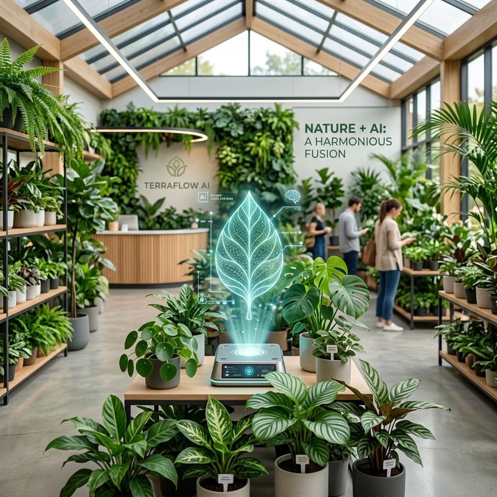

# 🌿 AI Nursery
## The Future of Plant Management
**AI Immersion Project**

---

# 📉 The Problem: Manual Chaos

Nursery owners face huge daily challenges:

- **Time-Consuming Support:** Customers repeatedly ask basic care questions, eating up the owner's time.
- **Scattered Communication:** Enquiries and orders come through WhatsApp and phone calls, easily getting lost.
- **Manual Inventory:** Tracking stock is entirely manual and error-prone.

---

# 💡 The Solution: Smart Dashboard

A complete, AI-powered digital storefront.

- **Automated AI Assistant:** Instantly answers customer care questions 24/7.
- **Centralized Dashboard:** A single portal for the owner to manage inventory, track orders, and reply to enquiries.
- **Seamless E-Commerce:** Beautiful catalog with intuitive checkout and automated tracking.

---

# 🤖 Key Feature: The AI Assistant

Instead of calling the nursery for basic questions, customers chat with our integrated AI!

- Visually identifies plants from user images.
- Provides tailored advice on soil, sunlight, and watering based on the specific plant.
- Available 24/7, meaning the business never sleeps and customers get immediate support.

---

# 📦 Key Feature: Operational Control

The Admin Dashboard provides full control for the owner:

- **Order Tracking:** Update statuses from *Pending* to *Delivered* with one click.
- **Enquiry System:** Reply directly to customer questions; customers see the official reply in their profile.
- **Inventory Control:** Instantly update prices, edit details, or mark items as *Out of Stock*.

---

# 🚀 Conclusion

The **AI Nursery** platform transforms a traditional, manual business into a scalable, automated digital storefront. 

By leveraging AI for customer support and a centralized dashboard for operations, the nursery owner can focus on what they do best: 

**Growing beautiful plants.**
